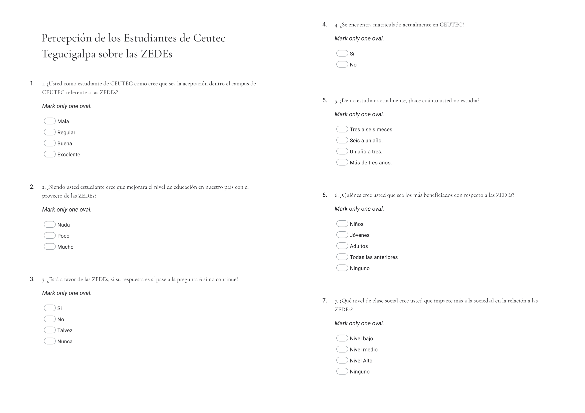
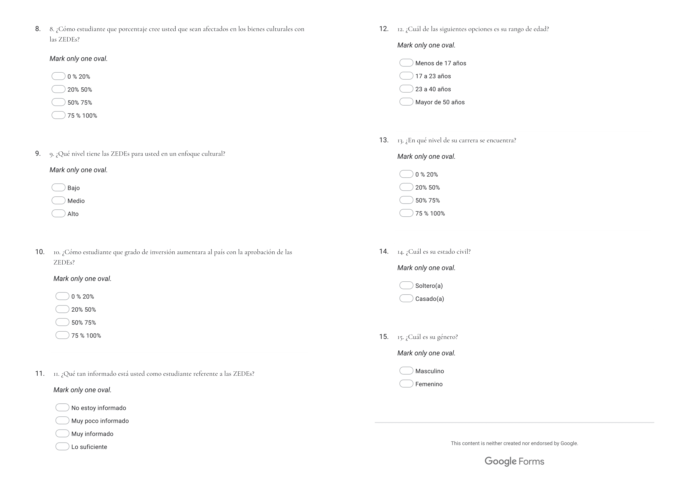

# Scenario

A group research was carried out for the subject Research Methodology during the period of September 2021, in this research a survey was applied that was answered randomly by students of Ceutec Tegucigalpa through a form that obtained 41 responses related to their perception of the ZEDE law.

Firstly, accordin to Wikipedia, Zone for Employment and Economic Development (Spanish: Zonas de empleo y desarrollo económico, or ZEDE) is the name of a new type of administrative division in Honduras (colloquially called a model city) that is subject under the national government and provides a high level of autonomy with its own political system, at a judicial, economic and administrative level. (Wikipedia Contributors, 2021)

# Roadmap according to Google "Phases of Data Analysis"

## Ask

### Guiding Questions

-   What topic are you exploring?

    -   Perception of students at CEUTEC Tegucigalpa University regarding the ZEDE law during September 2021

-   Who are the stakeholders?

    -   Lecturer in the subject of Research Methodology

-   Who is your audience?

    -   General Public

### Investigation Task

Identify patterns that correlate demographic attributes with the position with respect to the ZEDE law.

### Dataset

[Data obtained through the survey](https://www.kaggle.com/kevinosorto/ceutec-tgu-students-perception-about-zedes-92021)

### Metrics

1.  Age
2.  Gender
3.  Marital status (married, single)
4.  Percentage of university degree completed.
5.  Subject matter awareness (how informed the student considers him/herself to be about ZEDEs).

## Prepare

### Guiding Questions

-   Where is your data located?
-   How is the data organized?
-   Are there issues with bias or credibility in this data? Does your data ROCCC?
-   How are you addressing licensing, privacy, security, and accessibility?
-   How did you verify the data's integrity?
-   How does it help you answer your question?
-   Are there any problems with the data?

```{r}
# Loading Dataset
perception <- read.csv('ceutec_tgu_perception_zede.csv')
```

### Data Organization

#### Form Structure

 

#### Questions in the survey:

1.  As a CEUTEC student, how do you think the acceptance of the ZEDEs on the CEUTEC campus will be?\
2.  As a student, do you think that the level of education in our country will improve with the ZEDEs project?\
3.  Are you in favour of the ZEDEs?\
4.  Are you currently enrolled in CEUTEC?\
5.  If not currently studying, how long have you been out of college?\
6.  Who do you think will benefit the most from the ZEDEs?\
7.  What level of social class do you think has the greatest impact on society in relation to the ZEDEs?
8.  What percentage of students do you think will be affected by the ZEDEs in terms of cultural assets?\
9.  What level do you consider the ZEDEs to be culturally relevant?\
10. As a student, what degree of investment will the approval of the ZEDEs increase in the country?
11. How informed are you as a student regarding the ZEDEs?\
12. Which of the following is your age range?\
13. At which level of your career are you?\
14. What is your marital status?\
15. What is your gender?

```{r}
# install libraries
required_packages <- c('MASS', 'rcompanion', 'lsr', 'vcd', 'DescTools')
for (p in required_packages) {
  if(!require(p,character.only = TRUE)) {
    install.packages(p, dep = TRUE)
  }
}
```

```{r}
# load libraries
library(tidyverse)
library(dplyr)
library(hablar)
library(ggplot2)
library(MASS)
```

### Sort and filter

```{r}
# Column names changed to English and altered to a standardised format
colnames(perception) <- c('timestamp', 'acceptance_ceutec', 'education_improve', 'in_favour', 'enrolled_ceutec', 'out_college', 'most_benefited', 'social_class_benefited', 'per_students_affected', 'cultural_relevance', 'investment_increase', 'how_informed', 'age_range','college_per', 'marital_status', 'gender')
  

perception <- perception %>% 
  select(-timestamp)
  
perception <- perception %>%
  filter(enrolled_ceutec != "") %>% 
  filter(out_college != "Nunca") # Filtrar aquellos que Nunca han sido estudiantes


glimpse(perception)
```

### Credibility

The main problem is the sample size, currently 30 observations.

Let's say Ceutec TGU has 8000 thousand students and we want a 90% confidence level, we need a sample with 262 observations.

```{r}
# A sample size calculator function for R [http://news.mrdwab.com/post/sample-size-calculator/]

sample.size = function(c.lev, margin=.5,
                       c.interval=.05, population) {
  z.val = qnorm(.5+c.lev/200)
  ss = (z.val^2 * margin * (1-margin))/c.interval^2
  p.ss = round((ss/(1 + ((ss-1)/population))), digits=0)
  METHOD = paste("Recommended sample size for a population of ",
                 population, " at a ", c.lev,
                 "% confidence level", sep = "")
  structure(list(Population = population,
                 "Confidence level" = c.lev,
                 "Margin of error" = c.interval,
                 "Response distribution" = margin,
                 "Recommended sample size" = p.ss,
                 method = METHOD),
            class = "power.htest")
}

sample.size(90, , , 8000)

```

The sample may also be unrepresentative due to non-response and convenience biases, given the way the form was shared and that respondents were those who were interested. I will therefore proceed to analyse the sample in order to practice, but it is **not** significant for the population.

## Process

```{r}

perception$in_favour[perception$in_favour == "Si"] <- TRUE
perception$in_favour[perception$in_favour == "Nunca"] <- FALSE
perception$in_favour[perception$in_favour == "No"] <- FALSE
perception$in_favour[perception$in_favour == "Talvez"] <- NA

perception$enrolled_ceutec[perception$enrolled_ceutec == "Si"] <- TRUE
perception$enrolled_ceutec[perception$enrolled_ceutec == "No"] <- FALSE


```

Change data types

```{r}
perception <- perception %>% 
  convert(lgl(in_favour, enrolled_ceutec), fct(acceptance_ceutec, education_improve, out_college, most_benefited, social_class_benefited, per_students_affected, cultural_relevance, investment_increase, how_informed, age_range, college_per, marital_status, gender))%>% 
  arrange(desc(college_per))

glimpse(perception)

```

## Analyze

### Summarising categorical variables

```{r}
cat_per <- perception %>% 
  select(-in_favour, -enrolled_ceutec)

cat_prop <- function(col){
  # Returns proportions of categorical data in column
   round(100*prop.table(table(col)), digits = 2)
}

print_pro <- function(tbl){
    for(i in 1:ncol(tbl)){
      print(colnames(tbl[i]))
      tbl[i] %>% 
      cat_prop() %>% 
      print()
      
      print("······································································")
    }
  }


print_pro(perception)

```

### Demographic statistics

```{r}
ggplot(perception) +
 aes(x = marital_status, fill = gender) +
 geom_bar(position = "dodge") +
 scale_fill_manual(values = c(Femenino = "#8E0152", 
Masculino = "#276419")) +
 labs(title = "Marital Status", subtitle = "Married vs Single", caption = "The majority is represented by single men") +
 theme_gray()
```

```{r}
ggplot(perception) +
  aes(x = age_range) +
  geom_bar(position = "dodge", fill = "#112446") +
  labs(
    x = "Age Range",
    y = "Count",
    title = "Age distribution"
  ) +
  theme_gray()

```

```{r}
ggplot(perception) +
  aes(x = college_per, colour = age_range) +
  geom_bar(fill = "#112446") +
  scale_color_hue(direction = 1) +
  labs(
    x = "College Percentage Completed",
    y = "Count",
    title = "Percentage of college completed",
    subtitle = "Segmentation by age range",
    color = "Age Range"
  ) +
  theme_minimal()
```

### Contingency Tables - Education

100% of those who own as "Acceptance Ceutec" in "Exce, consider that there will be a 100% improvement in education.

```{r}
cross <- table(cat_per$acceptance_ceutec, cat_per$education_improve)
round(100 * prop.table(cross, 2), digits = 1)

barplot(prop.table(cross,2) * 100, xlab = "Acceptance Ceutec", ylab = "Education Improvement", main = "Acceptance Ceutec by Education Improvement", beside = T, col=c("green",  "red","yellow"), legend = rownames(cross), args.legend = list(x = "topleft"))

```

In the sample there is only one observation where the Ceutec acceptance is considered excellent, then it is to question and probe in the form filling.

```{r}
cat_per %>% 
  filter(acceptance_ceutec=="Excelente")
```

## Share

```{r}

ggplot(cat_per) +
 aes(x = most_benefited, fill = social_class_benefited) +
 geom_bar() +
 scale_fill_viridis_d(option = "viridis", 
 direction = 1) +
 labs(x = "Most Benefited", y = "Count", title = "Most benefited by Age Range", subtitle = "Segmentation by Social Class Benefited", 
 caption = "It is notable that the \"Most benefited\" results in \"None\", however at the level of \"Most benefited Social Class\" it is the \"Low Level\" that takes the largest share among the three age ranges.", 
 fill = "Social Class benefited") +
 theme_minimal() +
 facet_wrap(vars(age_range))
```

There are no discernible patterns correlating demographic attributes with ZEDE status. However, there are the following findings.

-   The approval of the ZEDE law is, in the majority, negative.
    -   0. 85.71% is against the ZEDE law.
    -   Acceptance for Ceutec is poor at 73.33%.
    -   The improvement of education is considered null by 66.67% and little by 30%.
    -   The most benefited by is considered to be None with 66.67%.
    -   Growth in investment (the main reason for the law) is at 46.7% with respect to the option "0% to 20%).

-  Cultural relevance is estimated at "Low" with 73%, which points to public inactivity regarding the law.


## Act
1. It is necessary to acquire a larger sample for better analysis.
2. The findings demonstrate the public considerations on the ZEDE law.
3. The next steps I propose is to establish more observations for the sample (300) by sharing the form on social media.
4. I assume it is relevant to ask in the survey "Which social class do you consider you belong to?" to correlate susceptibility to who benefits the most and the acceptance of the law.

# Bibliography

1.  Wikipedia Contributors. (2021). Zone for Employment and Economic Development (Honduras). In Wikipedia. <https://en.wikipedia.org/w/index.php?title=Zone_for_Employment_and_Economic_Development_(Honduras)&oldid=1049665114>
